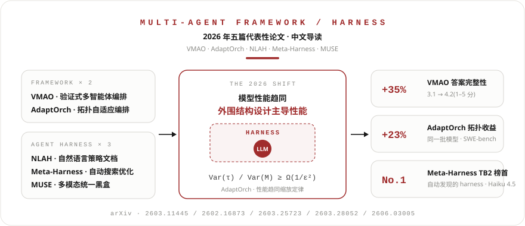

<div align="center">
  

  # Multi-Agent Framework / Harness · 2026 论文导读

  **五篇 2026 年 multi-agent framework 与 agent harness 代表性论文 · 中文摘要 + 原文 PDF**

  [📖 在线阅读](https://github.com/1parado/multi-agent-article/blob/main/index.html)
</div>

---

## 背景

当各家大模型在基准上的分数挤进 2–5% 的窄带，模型之外的结构设计成为新的性能主战场。

- **multi-agent framework** —— 协调多个 LLM agent 协作的结构：怎么拆任务、怎么并行、怎么合并、何时停止；
- **agent harness** —— 包裹在模型外围的执行系统：决定模型每一步看到什么、用什么工具、状态存哪里、何时验证、何时停止。

本仓库收录 2026 年这两条线上各具代表性的 **5 篇论文**，每篇提供中文摘要页（解决什么问题 → 创新点 → 关键结果 → 局限）与原文 PDF。

## 论文一览

| # | 论文 | 机构 / 发表 | 一句话 | 资料 |
|---|------|------------|--------|------|
| 01 | **VMAO** 验证式多智能体编排 | AWS + HSBC · ICLR 2026 WS | 把「验证」提升为编排层的一等协调信号：DAG 并行执行 → 独立检查员评估完整性 → 自动重规划补漏 | [中文版](https://github.com/1parado/multi-agent-article/blob/main/2603.11445_VMAO_中文版.html) · [PDF](https://github.com/1parado/multi-agent-article/raw/main/2603.11445_VMAO_Verified-Multi-Agent-Orchestration.pdf) · [arXiv](https://arxiv.org/abs/2603.11445) |
| 02 | **AdaptOrch** 任务自适应拓扑编排 | 韩国国民大学 | 证明模型趋同时「拓扑比选模型重要」（Var τ/Var M ≥ Ω(1/ε²)），线性时间算法按任务 DAG 自动选编排拓扑 | [中文版](https://github.com/1parado/multi-agent-article/blob/main/2602.16873_AdaptOrch_中文版.html) · [PDF](https://github.com/1parado/multi-agent-article/raw/main/2602.16873_AdaptOrch_Task-Adaptive-Multi-Agent-Orchestration.pdf) · [arXiv](https://arxiv.org/abs/2602.16873) |
| 03 | **NLAH** 自然语言 Agent Harness | 清华深研院 + 哈工大（深圳） | 把埋在控制器代码里的 harness 策略外化为可执行的自然语言文档，由共享运行时解释执行；策略层 60K → 2.9K token | [中文版](https://github.com/1parado/multi-agent-article/blob/main/2603.25723_NLAH_中文版.html) · [PDF](https://github.com/1parado/multi-agent-article/raw/main/2603.25723_Natural-Language-Agent-Harnesses.pdf) · [arXiv](https://arxiv.org/abs/2603.25723) |
| 04 | **Meta-Harness** harness 自动优化 | 斯坦福 + MIT + KRAFTON | 用 coding agent 经文件系统翻阅全部历史源码 / 分数 / 执行轨迹，自动搜索超越人类手工设计的 harness | [中文版](https://github.com/1parado/multi-agent-article/blob/main/2603.28052_Meta-Harness_中文版.html) · [PDF](https://github.com/1parado/multi-agent-article/raw/main/2603.28052_Meta-Harness_End-to-End-Optimization-of-Model-Harnesses.pdf) · [arXiv](https://arxiv.org/abs/2603.28052) |
| 05 | **MUSE** 多模态统一 Harness | 东北大学 + 北京大学 | 首个面向冻结 MLLM 的统一 harness：感知工具 + 确定性验证器 + 修复循环；GPT-4o 找字任务 3% → 21% | [中文版](https://github.com/1parado/multi-agent-article/blob/main/2606.03005_MUSE_中文版.html) · [PDF](https://github.com/1parado/multi-agent-article/raw/main/2606.03005_MUSE_Unified-Agentic-Harness-for-MLLMs.pdf) · [arXiv](https://arxiv.org/abs/2606.03005) |

## 共同趋势

1. **性能瓶颈正在从模型转移到模型外围** —— AdaptOrch 给出「模型趋同 → 编排主导」的定量证明；MUSE 证明多数多模态失败是 harness 层缺陷；Meta-Harness 实测 harness 差异可达 6 倍。
2. **「验证」是被反复确认的最有价值组件** —— VMAO 的编排层验证器带来 +35% 完整性；MUSE 的外置确定性验证器是修复循环的地基。共同原则：把生成与评估解耦，用模型外的信号判定成败。
3. **更多调用 ≠ 更好** —— MUSE 的等预算自一致性对照几乎无提升；NLAH 的多候选搜索分支翻倍却拖累成绩。算力堆在错误的结构里是浪费。
4. **行为无关的策略层迁移更稳** —— 为某模型精调的代码 harness 跨模型移植会系统性失败；策略层写得越「行为无关」，迁移越稳。

## 建议阅读顺序

**Meta-Harness**（harness 是什么、为什么重要）→ **NLAH**（harness 的表示与工程边界）→ **MUSE**（多模态落地）→ **AdaptOrch**（理论 + 路由算法）→ **VMAO**（工程化编排系统）

## 仓库结构

```
.
├── README.md                                  # 本文件
├── hero.svg                                   # 项目总览图
├── index.html                                 # 总览页（五篇速览 / 对比表 / 趋势）
├── 2603.11445_VMAO_中文版.html                 # 01 验证式多智能体编排
├── 2602.16873_AdaptOrch_中文版.html            # 02 任务自适应拓扑编排
├── 2603.25723_NLAH_中文版.html                 # 03 自然语言 Agent Harness
├── 2603.28052_Meta-Harness_中文版.html         # 04 Harness 端到端自动优化
├── 2606.03005_MUSE_中文版.html                 # 05 多模态统一 Harness
└── *.pdf                                      # 五篇论文原文
```

## 本地浏览

```bash
git clone https://github.com/1parado/multi-agent-article.git
```

克隆后直接用浏览器打开 `index.html` 即可（页面内链接指向 GitHub，联网时点击可跳转）。

---

> 论文版权归原作者与出版方所有；中文内容为学习交流整理，引用请以英文原文为准。
